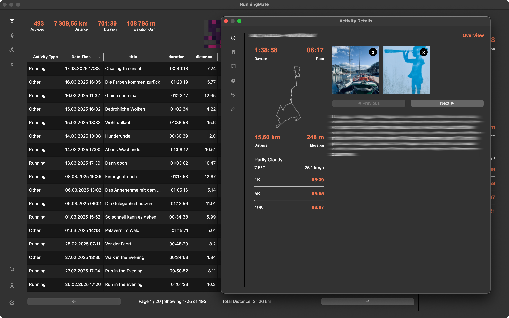
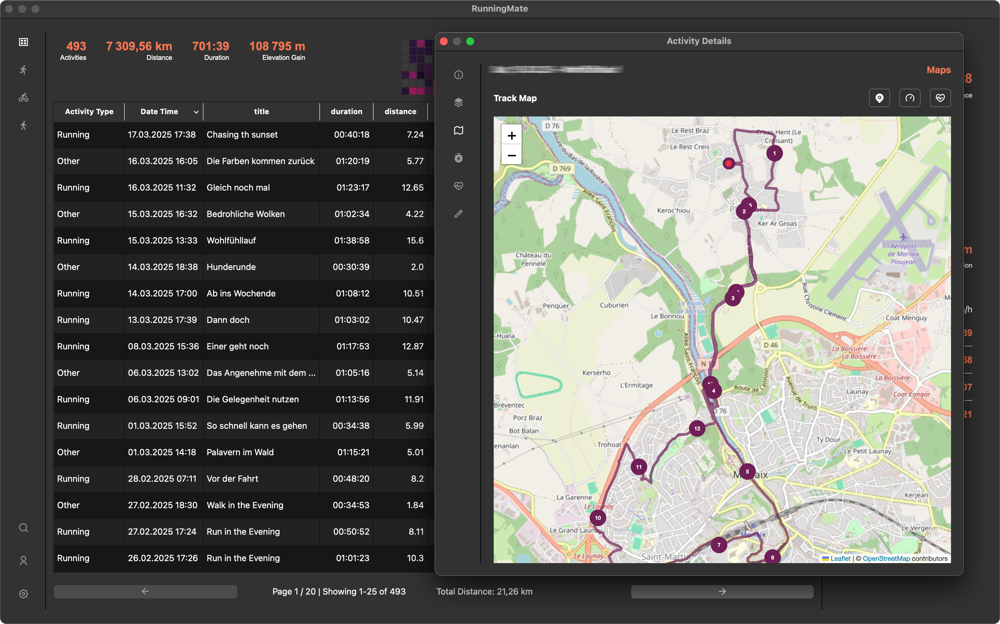
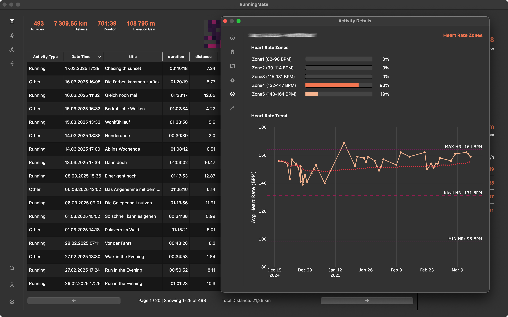

# Detail Window

Similar to the main window, the detail window has a menu bar on the left side, and a main section in the center. You can open
the detail window by clicking on the eye icon on the right side of each activity in the main window.
From top to bottom, you'll find the following sections:

## Overview
As in the main window, you'll see the key metrics of the activity, the track-map, and the weather data. 
If you uploaded images or videos, you'll see a gallery on the right side of the window, followed by the comments section.

## Segment Analysis
This section shows the segments of the activity. For running activities, each segment is a kilometer, for cycling activities, each segment is 5 kilometers. 
For each segment, you'll see the duration, pace, speed, heart rate, and power (if available).

## Maps

The map section shows the track of the activity. By using the buttons on the top right, you can switch between different map types (e.g., heart rate or pace).

## Heart Rate Zones

The heart rate zone section shows the distribution of your heart rate during the activity. 
You'll find the editor for the zones in the [user settings](user-settings.md)). You'll also find a 
trend chart showing the heart rate over the period of 90 days, if available.

## Editing
In the editing section, you can change the title, add a comment, and media files (images, videos). 
It's also possible to correct core data like distance, duration, and elevation gain, but keep in mind that this will not effect the segment data.