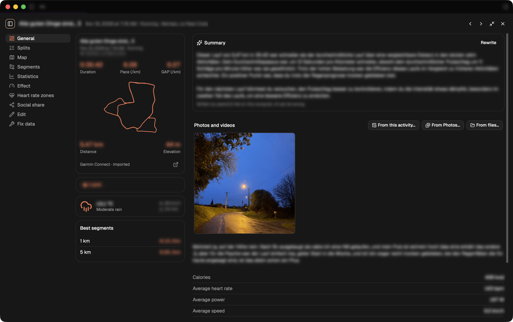
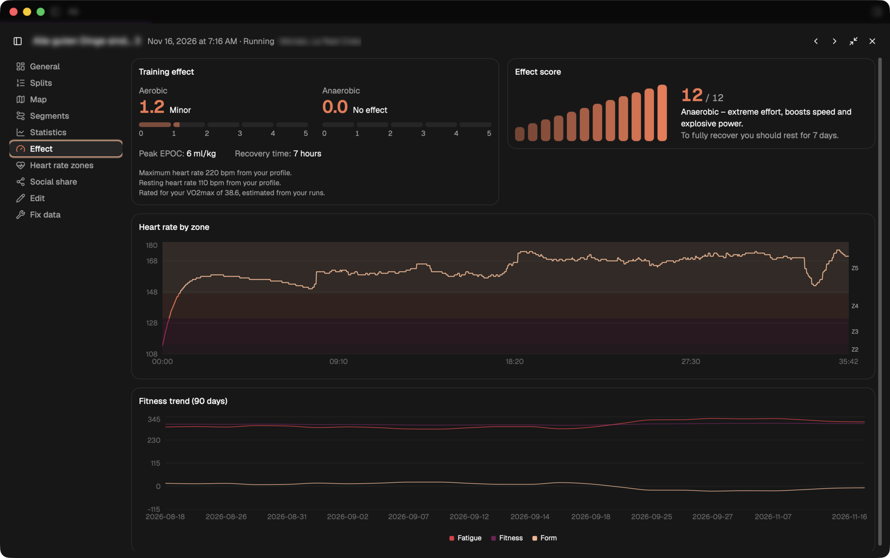

# Detail Window

Similar to the main window, the detail window has a menu bar on the left side, and a main section in the center. You can open
the detail window by clicking on the eye icon on the right side of each activity in the main window.
From top to bottom, you'll find the following sections:

## Overview
As in the main window, you'll see the key metrics of the activity, the track-map, and the weather data. 
If you uploaded images or videos, you'll see a gallery on the right side of the window, followed by the comments section.

## Splits

This section shows the splits of the activity. For running activities, each split is a kilometer, for cycling activities, each split is 5 kilometers. 
For each split, you'll see the duration, pace, speed, heart rate, and power (if available).

## Maps

The map section shows the track of the activity. By using the buttons on the top right, you can switch between different map types (e.g., heart rate or pace).
**Splits** shows or hides a list of the splits beside the map, with time and speed; click one to put a position dot where it ends
(the map moves there if needed, and the charts mark it). **Charts** shows elevation, heart rate and speed over the distance below the map (hidden at first, the choice is kept);
moving the mouse over them moves the position dot along the track.

## Segments
Lists the [segments](segments.md) this activity passes, each with its time, pace (speed for rides) and its place among
all tries, e.g. "2 of 7". A gold, silver or bronze trophy marks the three fastest places. Click a segment to highlight it on the map,
or open it to see its full ranking.

Arrows along the track show the direction you went, and the numbered markers the kilometres (5 km for rides), so you can
tell whether a stretch went up or down. Click **New segment** to mark one: click on the track where it starts, then where it
ends. Where the track passes the same spot more than once, the start is the first pass and the end the next pass after the start.
Use the slider to fine-tune both ends, check distance, average grade and the elevation profile, give it a title and save it.
The app then looks for passes over the new segment in all your activities of the same sport, in the background.

## Trainings Effect

The training effect section shows the aerobic and anaerobic training effect of the activity, if available. You can edit the calculation by clicking on the corresponding bar. 
If available, you'll also find a trend chart showing fitness, fatigue and form over the period of 90 days (relative to the activity date).

## Heart Rate Zones

The heart rate zone section shows the distribution of your heart rate during the activity. 
You'll find the editor for the zones in the [user settings](user-settings.md)). You'll also find a 
trend chart showing the heart rate over the period of 90 days, if available.

## Editing
In the editing section, you can change the title, add a comment, and media files (images, videos). 
It's also possible to correct core data like distance, duration, and elevation gain, but keep in mind that this will not effect the segment data.