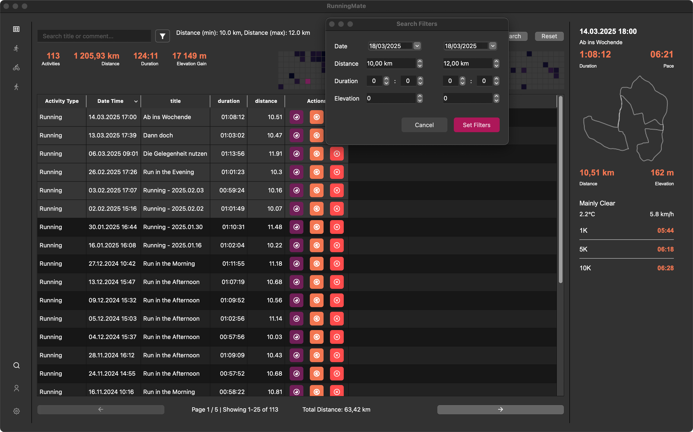

# Main Window

The main window of RunningMate is divided into three main sections: the menu bar, the activity list, and the activity details.

## Menu Bar (left)

Per default, you'll see all activities. You can easily filter the activities by type (running, cycling, walking) by clicking on the respective icon in the menu bar.
In the bottom part you'll have access to search, user - and system-settings.

## Activity list (center)
Above the list you'll find various key numbers, as the overall distance, duration and elevation gain. 
On the right, you see a activity heatmap.
Depending on calculated power of each activity the color becomes brighter. 
If you switch between the different activity types, the key numbers and the heatmap are updated with the stats of 
the respective activity type.

The activity list itself is sortable and has a pagination. Clicking on a row, the right side of the window will be updated, 
and you'll find the corresponding activity there. Clicking on the eye (deep purple button). You open the detail window. 
Clicking on the reloading button, the activity will be reprocessed. 
(In case some stats are not updating, or not updated, due to an older version of runningMate)
The delete button will delete the activity permanently from the db (and all corresponding files).

### Selecting multiple activities
You can select multiple activities by holding the `Ctrl` key and clicking on the rows. You'll then find the total distance at the bottom of the list, right beside the pagination.

## Activity details (right)
In case no activity is selected, you'll see the last registered activity, 
in case you're using a filter for the type, the latest activity of the respective type.
When you click on a row in the activity list, you'll see the details of that activity. 
The box shows the following data:
- Date and Time
- Title
- Duration (HH:MM:SS), Pace (MM:SS)
- A track-map (if available)
- Distance (KM), Elevation Gain (M)
- Weather data if available: Overall condition, temperature and wind
- Performances: Fastest 1KM, 5KM, 10KM, 21.1KM, 42.2KM (for running activities), 
  Fastest 5KM, 10KM, 25KM, 50KM, 100KM, 200KM (for cycling activities)

## The Search

To trigger the search, you can either press the search button in the bottom left corner or via the app menu bar 'view -> search', or the shortcut 'Ctrl + F'.
The search is case-insensitive and searches the title, the comment and if available the location(s) of the activity. In addition, you can filter by pressing the filter button in the search bar.
Available filters are: Date (from - to), Distance (from - to), Duration (from - to), and Elevation Gain (from - to), filters are inclusive. 

In case you have an active search, heatmap and key numbers are updated to the filtered activities.
