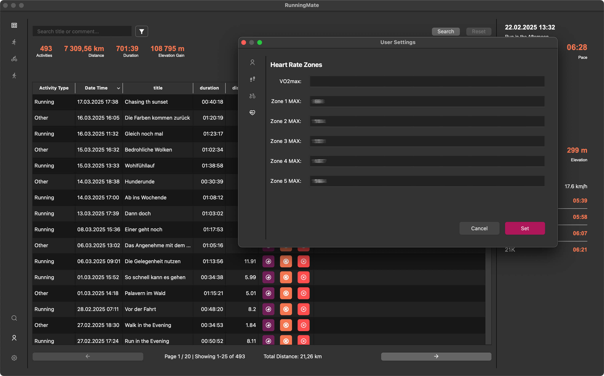

# User Settings
Similar to the main window, the user settings has a menu bar on the left side, and a main section in the center. You can open
the user settings by clicking on the user icon in the bottom left corner of the main window.
From top to bottom, you'll find the following sections:

## General Settings
The general settings are used to calculate metrics like Training Effect, VO2max, Heart Rate Zones and EPOC. 

## Shoes
You can add, edit and delete shoes here. The shoes are used to track the mileage of your running shoes.

## Bikes
You can add, edit and delete bikes here. The bikes are used to track the mileage of your bikes.

## Heart Rate Zones
In case you want to provide custom heart rate zones, you can do this here. This will be used for the calculation of the Training Effect of an activity, 
the VO2max and heart rate zones in the [detail window](detail-window.md).